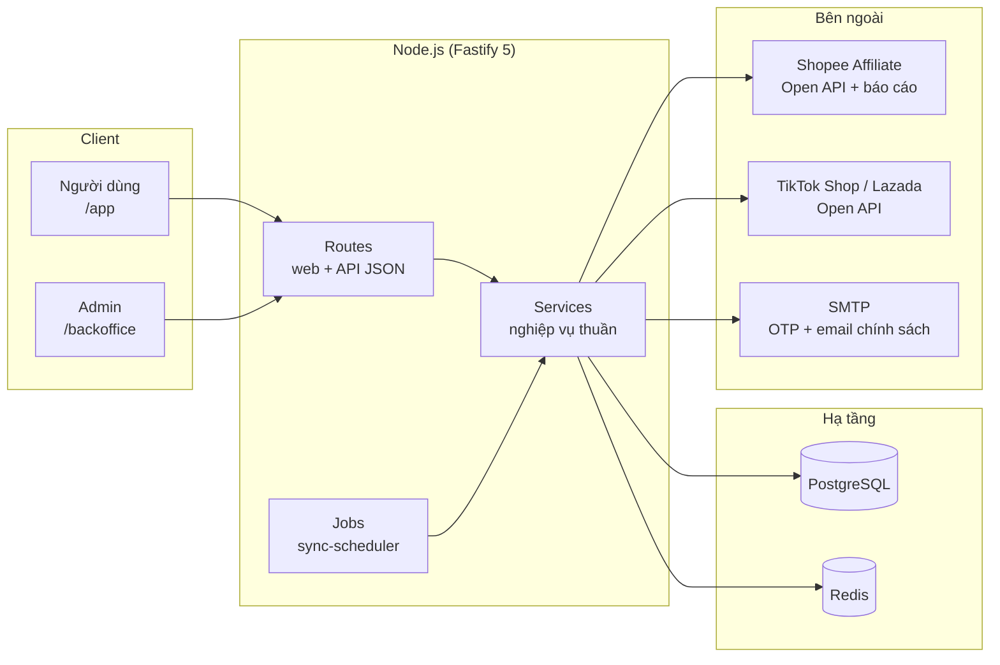

# 01 — Tổng quan dự án

## Bài toán

Người mua hàng online muốn được hoàn lại một phần tiền khi mua trên Shopee / TikTok Shop / Lazada.
ShopTik đứng giữa: kiếm **hoa hồng Affiliate** từ sàn, rồi **chia lại phần lớn hoa hồng đó
cho người mua** dưới dạng tiền hoàn (cashback).

Mô hình giống các nền tảng hoàn tiền lớn (ShopBack, Cashbag…): giá trị cốt lõi nằm ở việc
**đối soát chính xác** — biết đơn hàng nào trên sàn thuộc về người dùng nào của mình.

## Mô hình chia tiền

Khi sàn trả hoa hồng cho một đơn hàng:

```
Hoa hồng sàn trả (100%)
├── BUYER_CASHBACK_PERCENT (mặc định 80%) → tiền hoàn cho người mua
└── PLATFORM_SHARE_PERCENT (mặc định 20%) → phần nền tảng giữ lại
    └── một phần có thể thưởng cho người chia sẻ link (SHARER_REWARD_FROM_PLATFORM_PERCENT)
```

- Hai tỷ lệ đầu **bắt buộc cộng đúng 100** (validate trong `src/config.ts`).
- Các con số này là **giá trị seed** — sau lần khởi tạo đầu, admin sửa trực tiếp trong
  Backoffice → Cấu hình (`business_config` trong DB) và có hiệu lực ngay, không cần restart.
- Ngoài cashback còn có: thưởng giới thiệu bạn bè (referral) và thưởng nhiệm vụ (missions),
  cũng chi qua ledger.

## Kiến trúc tổng thể

Một tiến trình Node duy nhất, server-rendered, không SPA, không microservice:



Nguyên tắc phân lớp:

- **Routes** (`src/routes/`) — nhận request, validate input (zod), gọi service, render Nunjucks
  hoặc trả JSON. Không chứa nghiệp vụ.
- **Services** (`src/services/`) — nghiệp vụ thuần, nhận `db`/`config` qua tham số nên test
  được độc lập (Vitest + PGlite).
- **Jobs** (`src/jobs/sync-scheduler.ts`) — vòng lặp nền: đồng bộ báo cáo đơn từ sàn và
  giải ngân tiền hoàn đến hạn.
- **Views** (`views/`) + **static** (`public/`) — giao diện render phía server, JS thuần,
  không CDN (CSP chỉ cho phép `self`).

## Ba nhóm người dùng

| Nhóm | Vào đâu | Làm gì |
| --- | --- | --- |
| Người mua | `/app/*` | Tra cứu sản phẩm, mua hoàn tiền, xem đơn, ví, rút tiền, nhiệm vụ, giới thiệu |
| Admin/vận hành | `/backoffice/*` | Duyệt đơn, duyệt rút tiền, đối soát CSV, cấu hình nghiệp vụ, đồng bộ sàn, audit |
| Khách vãng lai | `/`, `/dieu-khoan`, `/chinh-sach-nguoi-dung` | Landing, pháp lý, redirect `/go/:clickId` |

Vai trò trong hệ thống: `USER`, `SUPPORT`, `FINANCE`, `RISK`, `ADMIN`, `AUDITOR`
(cùng `SUPER_ADMIN` cho admin mặc định). Admin có thể đồng bộ từ ENV
(`ADMIN_SYNC_FROM_ENV`, allowlist) hoặc tạo bằng `npm run admin:create`.

## Vì sao thiết kế như vậy (các quyết định chính)

- **Ledger kế toán kép thay vì cột `balance`** — tiền của người dùng thật, mọi biến động phải
  truy vết được, đảo được và idempotent. Xem [04 — Dữ liệu và ledger](04-du-lieu-va-ledger.md).
- **Preview không ghi DB** — người dùng tra cứu nhiều hơn mua rất nhiều; chỉ khi bấm
  "Mua ngay" mới tạo bản ghi. Preview sống trong cache in-memory TTL 15 phút.
- **Server-rendered, không CDN** — MVP ưu tiên đơn giản, bảo mật (CSP chặt), SEO tốt và
  chạy được sau Cloudflare Tunnel trên máy Windows.
- **Đối soát bằng Sub ID, không bao giờ bằng email** — email trong báo cáo sàn không tin được
  và là dữ liệu cá nhân; Sub ID do mình tự gắn vào link nên là bằng chứng mạnh nhất.
- **Test bằng PGlite** — chạy `npm test` không cần cài Postgres, migration được test thật.

## Tình trạng hiện tại (MVP)

- Shopee là sàn tích hợp sâu nhất: tra cứu qua Open API chính thức + tự động sync đơn
  từ báo cáo chuyển đổi. TikTok/Lazada đã có khung Open API nhưng token phải dán tay
  (chưa tự refresh OAuth).
- Google Login chưa bật (bảng `auth_identities` đã sẵn để thêm sau).
- **Chưa chi tiền tự động** — rút tiền do admin duyệt tay; chi tự động chờ hợp đồng
  với đối tác chi hộ, webhook và đối soát thật.

➡️ Tiếp theo: [02 — Luồng nghiệp vụ](02-luong-nghiep-vu.md)
