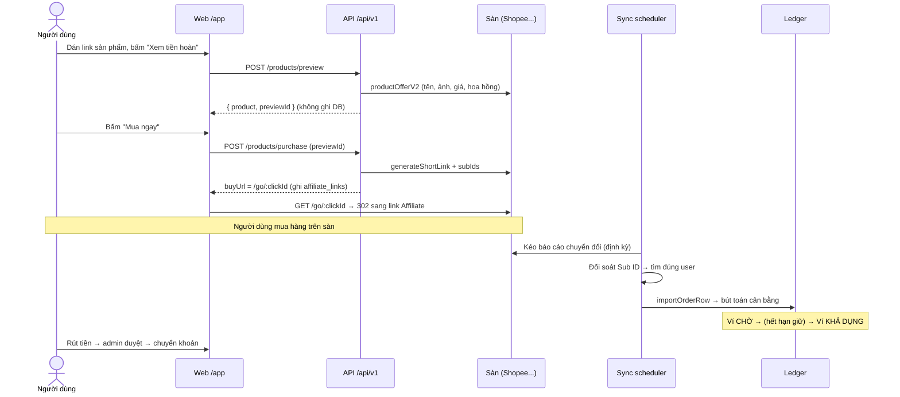

# 02 — Luồng nghiệp vụ mua hoàn tiền (end-to-end)

Đây là luồng quan trọng nhất của hệ thống. Mỗi bước ghi rõ **file xử lý** để bạn biết
sửa ở đâu.

## Bước 1 — Tra cứu sản phẩm (preview)

Người dùng dán link ở `/app` → bấm **Xem tiền hoàn** → `POST /api/v1/products/preview`
(`src/routes/api/products.ts`).

- `lookupProductPreview` (`src/services/product-preview.ts`) resolve link rút gọn rồi lấy
  dữ liệu theo thứ tự ưu tiên:
  1. **Shopee Affiliate Open API** (`src/services/shopee-open-api.ts`, GraphQL `productOfferV2`)
     — nguồn chính thức cho tên/ảnh/giá/tỷ lệ hoa hồng. Cần `SHOPEE_OPEN_API_APP_ID` + `SECRET`.
  2. Partner API tự cấu hình (`*_PRODUCT_API_URL`).
  3. API sàn / HTML công khai — thường bị chặn bot nên ảnh/giá có thể trống.
- Tiền hoàn dự kiến = hoa hồng × `buyerCashbackPercent` (lấy từ `business_config`).
- Kết quả trả `{ product, previewId }`; preview lưu tạm trong
  `src/services/preview-cache.ts` — **in-memory, TTL 15 phút, không ghi DB**.
- Nếu sàn chưa trả hoa hồng: vẫn cho mua nhưng hiển thị "Đang cập nhật", **không bịa số**.

Frontend: `views/app/dashboard.njk` + `public/purchase.js` + `public/instant-purchase.css`.

## Bước 2 — Mua ngay (tạo purchase intent)

Bấm **Mua ngay** → `POST /api/v1/products/purchase` với `previewId`
→ `createPurchaseIntent` (`src/services/affiliate.ts`):

- Build link Affiliate theo sàn:
  - **Shopee**: `generateShortLink` qua Open API, kèm **subIds** do `buildSubIdParts` dựng:
    `[c<clickId>, u<users.tracking_code>, p<productId>, source, campaign]`.
    Fallback khi Open API lỗi: `s.shopee.vn/an_redir`.
  - **TikTok / Lazada**: qua partner API "convert" (`tiktok-open-api.ts`, `lazada-open-api.ts`).
- Ghi `affiliate_programs` + `affiliate_links` (đây là lần ghi DB đầu tiên trong luồng).
- Trả `buyUrl = /go/:clickId`.

## Bước 3 — Redirect qua sàn

Trình duyệt mở `buyUrl` → `GET /go/:clickId` (`src/routes/public.ts`):

- Kiểm tra allowlist host đích (`isSafeAffiliateRedirect`) — chặn open redirect.
- Ghi `click_events`, rồi 302 sang link Affiliate của sàn.

Ngay từ bước 2, lượt mua đã hiện ở `/app/orders` dạng **"Chờ sàn xác nhận"**:
`listOrderHistory` (`src/services/order-history.ts`) gộp bảng `orders` với các
`affiliate_links` campaign `instantbuy` chưa có đơn khớp. Bản ghi ảo này tự biến mất
khi bước 4 gán được đơn thật cho link.

## Bước 4 — Đơn về và đối soát

Đơn đổ về theo **hai đường**, cùng chảy vào `importOrderRow` (`src/services/order-import.ts`):

### 4a. Tự động (đường chính)

`src/jobs/sync-scheduler.ts` tick mỗi `SYNC_SCHEDULER_TICK_SECONDS` (mặc định 60s)
→ `runShopeeOrderSync` (`src/services/shopee-order-sync.ts`) gọi báo cáo chuyển đổi Shopee
(`src/services/shopee-report.ts`):

- Cookie đăng nhập + tần suất do admin đặt tại **`/backoffice/sync`**, lưu **mã hóa** trong
  bảng `platform_sync_settings` (`src/services/platform-sync-settings.ts`).
- Mặc định 60 phút/lượt, kéo đơn 30 ngày gần nhất.

### 4b. Thủ công (dự phòng)

Import CSV tại **`/backoffice/reconciliation`** (`src/routes/admin-orders.ts`).

### Đối soát tìm đúng người mua (`resolveUser`)

Sub ID nằm trong `utm_content` của báo cáo, các mảnh nối bằng `-` và **có thể bị sàn cắt
bớt đuôi**. Thứ tự đối soát:

1. Mã lượt click (`c<clickId>`) — khớp trực tiếp `affiliate_links`.
2. Sub ID nguyên vẹn.
3. Cặp `u<tracking_code>` + `p<productId>` — chọn lượt bấm mua **gần nhất trước giờ mua**
   và **chưa gắn đơn nào**.

⚠️ **Không bao giờ suy ra người mua từ email** trong báo cáo sàn.

### Trạng thái đơn sau import

| Trạng thái sàn | Kết quả trong hệ thống |
| --- | --- |
| `COMPLETED` | `APPROVED` — ghi bút toán cộng tiền vào ví CHỜ |
| `CANCEL` | `CANCELLED` — đảo khoản (nếu đã ghi) + hiện lý do cho người dùng |
| Còn lại | `PENDING` — đang duyệt, hỏi lại ở lượt sync sau |

Khi sàn **sửa hoa hồng** lúc đơn còn chờ: hệ thống đảo khoản cũ rồi ghi khoản mới với
`cashback_revision` kế tiếp (idempotency key hậu tố `:revN`).

## Bước 5 — Cộng tiền và giải ngân

- Mọi biến động tiền qua **bút toán ledger cân bằng** (`src/services/ledger.ts`) —
  không bao giờ UPDATE trực tiếp số dư. Chi tiết: [04 — Dữ liệu và ledger](04-du-lieu-va-ledger.md).
- Đơn `APPROVED` nằm ở **ví CHỜ** thêm `cashback_hold_days` (Cấu hình nghiệp vụ, mặc định
  30 ngày) tính từ `orders.completed_at` — đề phòng sàn hủy/hoàn đơn.
- `releaseDueCashback` (`src/services/cashback-release.ts`, chạy trong sync-scheduler)
  chuyển các khoản đến hạn sang **ví KHẢ DỤNG**.

## Bước 6 — Rút tiền

- Người dùng thêm tài khoản ngân hàng ở `/app/banks` (số tài khoản mã hóa AES-256-GCM,
  chỉ hiện 4 số cuối; thay đổi cần admin duyệt — `bank_change_requests`).
- Tạo lệnh rút ở `/app/withdrawals` — xác nhận qua **OTP email**, tiền chuyển từ ví
  KHẢ DỤNG sang ví ĐANG GIỮ (`FUNDS_HELD`).
- Admin duyệt tại `/backoffice/withdrawals`: duyệt → chuyển khoản tay → đánh dấu `PAID`
  (ví ĐANG GIỮ → ĐÃ CHI); từ chối → hoàn tiền về ví KHẢ DỤNG.
- Chưa có chi tự động (chờ đối tác chi hộ).

## Các luồng phụ

| Luồng | Điểm vào | Service |
| --- | --- | --- |
| Đăng ký + xác thực email OTP | `/dang-ky` (`src/routes/auth.ts`) | `auth.ts`, `otp.ts`, `email.ts` |
| Chính sách người dùng (1 nguồn duy nhất) | `/chinh-sach-nguoi-dung` + modal + email khi đăng ký | `user-policy.ts` — sửa nội dung ảnh hưởng quyền lợi thì tăng `USER_POLICY_VERSION` |
| Link chia sẻ kiếm thưởng | `/app/links` | `affiliate.ts` (campaign khác `instantbuy`) |
| Giới thiệu bạn bè | `/app/referrals` | `referral-reward.ts` — thưởng khi người được mời có đơn duyệt đầu tiên |
| Nhiệm vụ + thông báo | `/app/nhiem-vu` | `mission.ts` — admin duyệt claim ở backoffice |
| Khám phá nội dung/sản phẩm | `/app/discover` | `content-image.ts`, bảng `content_items` |
| Hỗ trợ (ticket) | `/app/support` ↔ `/backoffice/support` | — |

➡️ Tiếp theo: [03 — Cấu trúc mã nguồn](03-cau-truc-ma-nguon.md)
